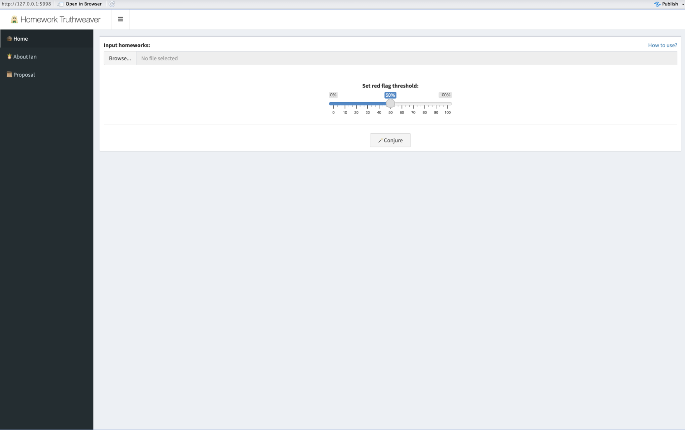
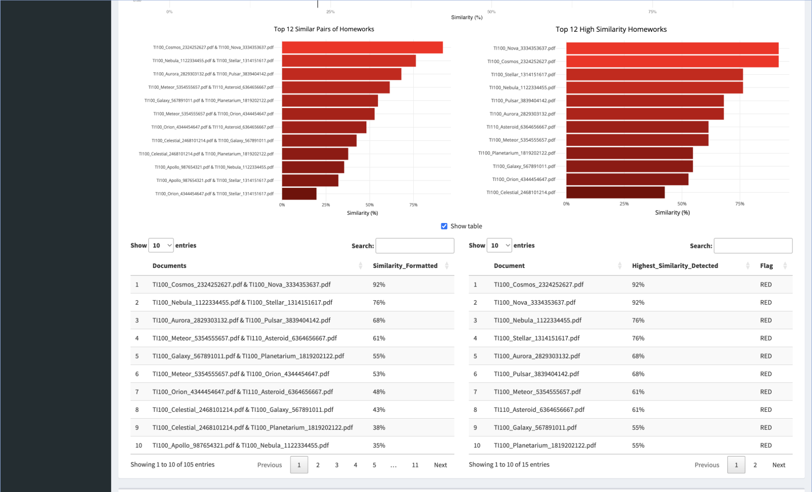

<h5 style="text-align: center;">Ardian the Great</h5>
<h5 style="text-align: center;">December 1st, 2023</h5>
<h3 style="text-align: center;">Homework Similarity Analysis Tool</h3>
---

# Introduction
## **Background**
In November 2023, my homework got rejected because I used ChatGPT. But, students who didn’t use ChatGPT but copied from each other didn’t face any issues, they weren’t caught and their work wasn’t rejected. This situation motivated me to create an app that looks into similarities in homework. So, here it is, Homework Truthweaver.

## **Project Idea**
Homework Truthweaver is an innovative web application designed to tackle the challenges of identifying plagiarism and dishonesty in academic work. Inspired by a personal experience where a ChatGPT-generated homework was rejected while other instances of copying went unnoticed, this project aims to bring fairness and accuracy to the evaluation of academic assignments.

## **Methodologies**
### Cosine Similarity
Cosine similarity is a metric used to measure the similarity between two vectors. In the context of text analysis, these vectors often represent the term frequency of words in documents. The cosine of the angle between the vectors is computed, resulting in a similarity score. A score of 1 indicates identical vectors, while 0 implies no similarity.

### TF-IDF Weighting
TF-IDF (Term Frequency-Inverse Document Frequency) is a numerical statistic that reflects the importance of a word in a document relative to a collection of documents (corpus). It is calculated by multiplying the term frequency (TF) with the inverse document frequency (IDF). TF measures how often a word appears in a document, while IDF assesses the rarity of a word across the entire corpus. TF-IDF is valuable in text analysis as it emphasizes words that are both frequent in a document and unique across the corpus, providing a more nuanced understanding of document content. TF-IDF weighting enhances cosine similarity by considering the importance of words in a document and across the entire corpus. Unlike regular cosine similarity, TF-IDF diminishes the impact of common words that appear frequently but are less informative. By highlighting unique and relevant terms, TF-IDF provides a more refined measure of document similarity, improving the accuracy of text analysis.

### N-Grams
N-grams are contiguous sequences of n items from a given sample of text or speech. In the context of text analysis, these items are often words. Unigrams (1-grams) represent single words, bigrams (2-grams) are pairs of consecutive words, and trigrams (3-grams) consist of three-word sequences, and so on. N-grams capture local patterns and relationships between words, allowing for a more comprehensive analysis of language structure. (“this”, “is”, “an”, “example”, “of”, “one”, “gram”), (“this is”, “is an”, “an example”, “example of”, “of two”, “two grams”), and (“this is an”, “is an example”, “an example of”, “example of three”, “of three grams”).

## **Project Output**
The output of this project is a Shiny Apps based Web App that can be used by anyone for analyzing document/homework similarities. And the goal is to identify instances of work dishonesty in homework grading using cosine similarity with TF-IDF weighting.

## **Impact**
### Academic Integrity Boost
Homework Truthweaver enhances academic integrity by employing advanced text analysis. Its implementation of cosine similarity with TF-IDF weighting identifies subtle patterns indicative of work dishonesty, surpassing traditional methods.

### Fair and Consistent Grading
The Analyzer promotes fairness and consistency in grading by uncovering nuanced cheating patterns. This ensures an equitable evaluation process, addressing potential disparities in treatment among students.

### Motivation for Excellence
The presence of the Analyzer serves as a motivator for students to produce original work, fostering a culture of academic excellence and deterring plagiarism.

### Improved Assessment Practices
Insights from the Analyzer’s visualization of similarity distributions empower educators to refine assessment practices continuously, adapting teaching methods and implementing proactive measures against academic dishonesty.

### Future Research Opportunities
The project opens avenues for future research on cheating patterns and academic integrity, contributing to broader scholarly discourse in educational settings.

### User-Empowered Education
The Analyzer provides educators with a user-friendly tool that not only identifies potential cheating cases but also offers valuable insights to inform instructional strategies, cultivating a culture of honesty and diligence.

## **Work Flow**
### Input:
The inputs will be homework PDFs and red flag threshold (ranging from 0% to 100%)

### Data Preprocessing:
The app converts these PDF files into raw text. Finally, the app creates a data frame containing the raw text of the pdf and the file names as row names.

### Text Preprocessing:
The text processing involves converting all text to lowercase, removing stop-words, punctuation marks, and applying text stemming to reduce words to their base forms. Additionally, extra spaces are eliminated as part of the preprocessing steps.

### Cosine Similarity with TF-IDF weighting Calculation:
The process includes converting texts into corpus, creating a Document-Term Matrix with TF-IDF weighting, and calculating the cosine similarity matrix.

### Similarity Ranking and Flagging:
With the calculated similarities, I then create two rankings, pair similarity ranking and individual homework similarity ranking. And, I also flag the pairs and individual homeworks, pairs and individual homeworks that has similarity equals or higher than red flag threshold will be considered red flags.

### Analytics:
With all the process that’s been done previously, the app then displays visualizations and tables, which are similarity distribution density, pair similarity ranking bar chart and table, and individual homework similarity bar chart and table.

### Pair Analysis:
With all the process that’s been done previously, the app new feature called Pair Analysis. With this feature, the user can input two documents. When one document is input, the user can see the work’s status (red flag or green flag), following with the similar works that exist. When two documents are input, the user can see the similarity and flag status of the pair (red flag or green flag), the web-app will also show n gram input that is gonna be set to one gram on default, then tokenize the texts of the input documents with the input n gram, and then displays 3 following word clouds: 1st document’s unique words; intersect words; and 2nd document’s unique words.

# Back-end Functions
## **Used Libraries**
```{r message=FALSE}
library(dplyr)
library(tm)
library(NLP)
library(proxy)
library(pdftools)
library(tools)
library(scales)
library(stringr)
library(tokenizers)
library(wordcloud)
library(RColorBrewer)
library(ggplot2)
library(plotly)
```

## **Folder to Table Converter Function**
The `folder_to_table()` function serves the purpose of transforming a folder of PDF documents into a structured table, represented as a data frame. The resulting data frame comprises the pdf file names as row names, and a column, text, which contains the cleaned raw text extracted from the PDFs.

### Function Input:
- ***folder_path***: This parameter specifies the path to the folder containing the PDF files to be processed. It should be provided as a character string.

### Function Workflow:
1. Extract the raw text
2. Extract the file name
3. Create the data frame

### Function Output:
The output is a data frame with the row names representing the file name and column text representing the raw extracted text.

### Function Code:
```{r}
folder_to_table <- function(folder_path) {
  # Function to convert PDF to text
  convert_pdf_to_text <- function(pdf_path) {
    pdf_text_content <- pdf_text(pdf_path)
    
    extracted_text <- list()
    
    for (page in seq_along(pdf_text_content)) {
      text <- pdf_text_content[[page]]
      extracted_text[[page]] <- text
    }
    
    all_text <- paste(extracted_text, collapse = "\n")
  }
  
  # Function to get file name
  get_file_name <- function(file_path) {
    file_path_sans_ext(basename(file_path))
  }
  
  # Getting PDF files from the specified folder
  pdf_files <- list.files(folder_path, pattern = ".pdf", full.names = TRUE)
  
  # Converting PDFs to text
  pdf_texts <- lapply(pdf_files, convert_pdf_to_text)
  
  # Creating a data frame with file names and extracted text
  table_data <- data.frame(
    file_name = paste(sapply(pdf_files, get_file_name), ".pdf", sep = ""),
    text = unlist(pdf_texts)
  )
  
  # Renaming the data frame rows with the file names
  rownames(table_data) <- table_data$file_name
  
  return(table_data %>% select(text))
}
```

### Function Test:
```{r}
df <- folder_to_table("dataset")

df
```

## **Text Cleaner Function**
The `clean_text()` function is designed to clean text data.

### Function Input:
- ***text***: Raw text input.
- ***as_corpus***: If TRUE, the function will return the text in the form of a corpus.
- *Other conditional statements*: These are conditional statements specifying transformations to be applied to the text.

### Function Workflow:
1. Transform the input text into a text corpus
2. Convert all text to lowercase
3. Remove stop-words
4. Remove punctuation marks
5. Apply text stemming to reduce words to their base forms
6. Eliminate extra spaces
7. Return the cleaned text corpus

### Function Output:
The output is the cleaned text in the form of a character or corpus based on the `as_corpus` argument.

### Function Code:
```{r}
clean_text <- function(text, as.corpus = T, lower = T, rm.number = T, rm.stopwords_english = T, rm.stopwords_bahasa = T, rm.punctuation = T, stem = T, rm.whitespace = T){
  text_corpus <- text %>% VectorSource() %>% VCorpus()
  
  # Lowercasing
  if (lower){
    text_corpus <- tm_map(x = text_corpus,
                          FUN = content_transformer(tolower))
  }
  # Removing numbers
  if (rm.number){
    text_corpus <- tm_map(x = text_corpus,
                          FUN = removeNumbers)
  }
  # Removing english stop words
  if (rm.stopwords_english){
    list_stop_words_english <- readLines("stop-words_english.txt", warn = FALSE, encoding = "UTF-8")
    
    text_corpus <- tm_map(x = text_corpus,
                          FUN = removeWords,
                          list_stop_words_english)
  }
  # Removing bahasa stop words
  if (rm.stopwords_bahasa){
    list_stop_words_bahasa <- readLines("stop-words_bahasa.txt", warn = FALSE, encoding = "UTF-8")
    
    text_corpus <- tm_map(x = text_corpus,
                          FUN = removeWords,
                          list_stop_words_bahasa)
  }
  # Removing punctuation
  if (rm.punctuation){
    text_corpus <- tm_map(x = text_corpus,
                          FUN = removePunctuation)
  }
  # Reducing words to their base form
  if (stem){
    text_corpus <- tm_map(x = text_corpus,
                          FUN = stemDocument)
  }
  # Removing white/blank spaces
  if (rm.whitespace){
    text_corpus <- tm_map(x = text_corpus,
                          FUN = stripWhitespace)
  }
  
  # Returning the text as or not as corpus
  if (as.corpus){
    return(text_corpus)
  }
  else(
    return(sapply(text_corpus, as.character))
  )
}
```

> You may think "Why you gotta put if else statements for each transformation?" Well it's because this function is taken directly from my personal package.

### Function Test:
```{r}
df$text <- clean_text(df$text, F)

df %>% head()
```

## **Word Cloud Function**
The `get_wordcloud()` function is created to generate a word cloud that emphasizes words for specific analysis.

### Function Input:
- ***words***: A string of words.

### Function Workflow:
1. Tokenize the words
2. Create a data frame containing the frequency of each word
3. Generate a word cloud plot

### Function Output:
The output is a word cloud plot representing the input text/words.

### Function Code
```{r}
get_wordcloud <- function(words, palette, n_gram = 1){
  # Tokenizing the input string into individual words
  words_list <- tokenize_ngrams(words, n = n_gram) %>% unlist()
  upper_scale <- ifelse(n_gram > 1, 2, 3)
  
  # Creating a data frame of matching words and count their occurrences.
  words <- data.frame(word = words_list) %>%
    count(word, sort = TRUE)
  
  # Generating a word cloud with specified settings, scaling word size by frequency
  words %>%
    with(
      wordcloud(
        words = word,
        random.order = FALSE,
        color = brewer.pal(9, palette),
        min.freq = 1,
        scale = c(upper_scale, 1),
        rot.per = 0,
        freq = n,
      )
    )
}
```

### Function Test {.tabset}

#### Unigram
```{r warning=FALSE}
get_wordcloud(df[1, 1], "Greens", 1)
```

#### Bigram
```{r warning=FALSE}
get_wordcloud(df[1, 1], "Greens", 2)
```

#### Trigram
```{r warning=FALSE}
get_wordcloud(df[1, 1], "Greens", 3)
```

## **TF-IDF Cosine Similarity Function**
The `get_cosine_similarity_matrix()` function is developed to compute the cosine similarity of texts using TF-IDF weighting.

### Function Input:
- ***df***: A data frame resulting from the `folder_to_table()` function.

### Function Workflow:
1. Convert texts into a corpus
2. Create a Document-Term Matrix with TF-IDF weighting
3. Calculate the cosine similarity matrix

### Function Output:
The output is a cosine similarity matrix.

### Function Code:
```{r}
get_cosine_similarity_matrix <- function(df) {
  # Converting texts to vector corpus
  corpus <- VCorpus(VectorSource(df$text))
  
  # Creating a Document-Term Matrix with TF-IDF weighting
  dtm <- DocumentTermMatrix(corpus)
  rownames(dtm) <- rownames(df)
  dtm_tfidf <- weightTfIdf(dtm)
  
  # Converting the DTM to a regular matrix
  dtm_matrix <- as.matrix(dtm_tfidf)
  
  # Calculating the cosine similarity matrix
  similarities <- simil(dtm_matrix, method = "cosine")
  
  # Converting to a regular matrix
  similarity_matrix <- as.matrix(similarities)
  
  # Replacing NA values with 1
  similarity_matrix[is.na(similarity_matrix)] <- 1
  
  return(similarity_matrix)
}
```

### Function Test:
```{r}
similarity_matrix <- get_cosine_similarity_matrix(df)

as.data.frame(similarity_matrix)[1:10, 1:10]
```

## **Pair Similarity Ranking Function**
The `get_pair_similarity_ranking()` function is developed to rank every pair of homeworks based on their calculated similarity.

### Function Input:
- ***similarity_matrix***: A matrix resulting from the `get_cosine_similarity_matrix()` function.
- ***red_flag_threshold***: A percentage number used to flag pairs; pairs with similarity equal to or above the threshold will be flagged as "RED."

### Function Workflow:
1. Convert the similarity matrix into a long-format data frame
2. Sort the data frame by similarity values in descending order
3. Remove rows where the pair consists of the same document
4. Remove duplicated rows
5. Flag each pair
6. Return the ranking data frame

### Function Output:
A data frame with three columns: Documents (pair of documents); Document_1; Document_2; Similarity; Similarity_Formatted; and Flag.

### Function Code:
```{r}
get_pair_similarity_ranking <- function(similarity_matrix, red_flag_threshold){
  # Converting the similarity matrix into a long format data frame
  similarity_long <- as.data.frame(as.table(similarity_matrix))
  
  # Sorting the data frame by similarity values in descending order
  similarity_sorted <- similarity_long %>% arrange(desc(Freq))
  
  # Completing the ranking data frame
  ranking <- similarity_sorted %>%
    # Removing the rows of two same document and removing duplicated rows
    filter(Var1 != Var2,
           row_number() %% 2 != 0) %>% 
    # Creating column 'Documents' by combining both documents
    mutate(Documents = paste(Var1, "&", Var2)) %>% 
    # Renaming the columns
    rename(Document_1 = Var1,
           Document_2 = Var2,
           Similarity = Freq) %>% 
    # Formatting the similarity values, and adding flag to the documents
    mutate(Similarity_Formatted = round(Similarity * 100) %>% paste0("%"),
           Flag = ifelse(Similarity >= red_flag_threshold, "RED", "GREEN")) %>% 
    # Rearranging the columns
    select(Documents, everything())
  
  return(ranking)
}
```

### Function Test:
```{r}
red_flag_threshold <- 0.1

pair_similarity_ranking <- get_pair_similarity_ranking(similarity_matrix, red_flag_threshold)

pair_similarity_ranking
```

## **Homework Similarity Ranking Function**
The `get_homework_similarity_ranking()` function is developed to rank every homework based on their highest calculated similarity.

### Function Input:
- ***similarity_matrix***: A matrix resulting from the `get_cosine_similarity_matrix()` function.
- ***red_flag_threshold***: A percentage number used to flag homework; homework with the highest similarity equal to or above the threshold will be flagged as "RED."

### Function Workflow:
1. Convert the similarity matrix into a long-format data frame
2. Sort the data frame by similarity values in descending order
3. Remove rows where the pair consists of the same document
4. Group by each document
5. Keep only the row with the highest similarity within each homework
6. Flag each homework

### Function Output:
A data frame with three columns: Document; Document_2; Highest_Similarity; Highest_Similarity_Formatted; and Flag.

### Function Code:
```{r}
get_homework_similarity_ranking <- function(similarity_matrix, red_flag_threshold){
  # Converting similarity matrix to a long format data frame
  similarity_long <- as.data.frame(as.table(similarity_matrix))
  
  # Completing the ranking data frame
  ranking <- similarity_long %>% 
    # Removing the rows of two same document
    filter(Var1 != Var2) %>% 
    # Renaming the columns
    rename(Highest_Similarity = Freq,
           Document = Var2,
           Other_Document = Var1) %>% 
    
    # Grouping by Document and select the pair with the highest similarity
    group_by(Document) %>% 
    top_n(1, wt = Highest_Similarity) %>%
    
    # Adding flags and formatting the similarity values
    mutate(Flag = ifelse(Highest_Similarity >= red_flag_threshold, "RED", "GREEN"),
           Highest_Similarity_Formatted = paste0(round(Highest_Similarity * 100), "%")) %>% 
    # Arranging the rows by similarity values in descending order
    arrange(desc(Highest_Similarity)) %>% 
    
    # Selecting relevant columns
    select(Document, Other_Document, Highest_Similarity, Highest_Similarity_Formatted, Flag)
  
  return(ranking)
}
```

### Function Test:
```{r}
homework_similarity_ranking <- get_homework_similarity_ranking(similarity_matrix, red_flag_threshold)

homework_similarity_ranking
```

## **Similar Works Function**
The `get_similar_works()` function is developed to retrieve similar works for the input documents.

### Function Input:
- ***pair_similarity_ranking***: A ranking resulting from the `get_pair_similarity_ranking()` function.
- ***document***: The document name.

### Function Workflow:
1. Filter the `pair_similarity_ranking` row containing the input document
2. Filter the row where it’s flagged as "RED"
3. Return the similar works data frame

### Function Output:
The output is a data frame containing documents that are similar to the input document. Consists of two columns, Document (document name) and Similarity.

### Function Code:
```{r}
get_similar_works <- function(pair_similarity_ranking, document) {
  
  similar_works <- pair_similarity_ranking %>% 
    # Filter pair_similarity_ranking where it's input_homework and where it's red flag
    filter(
      document == Document_1 | document == Document_2,
      Flag == "RED"
    ) %>% 
    
    # Modifying the Document column by removing input_homework and "&" from the Documents column
    mutate(
      Document = gsub(paste(c(document, "&"), collapse = "|"), "", Documents),
      Document = trimws(Document)
    ) %>% 
    
    # Selecting and reformatting the similarity value
    select(Document, Similarity_Formatted) %>% 
    rename(Similarity = Similarity_Formatted)
  
  # Return the resulting data frame
  return(similar_works)
}
```

### Function Test:
```{r}
similar_works_19164410 <- get_similar_works(pair_similarity_ranking, "TI100_Asteroid_6364656667.pdf")

similar_works_19164410
```

## **Intersect and Distinct Words Function**
The `get_intersect_and_distinct_words()` function is developed to extract intersect and distinct tokens between two texts.

### Function Input:
- ***text_1***: A string of words/tokens for the 1st document.
- ***text_2***: A string of words/tokens for the 2nd document.

### Function Workflow:
1. Tokenize both texts
2. Combine both tokens
3. Find intersect tokens
4. Create a map of the 1st document’s distinct tokens, intersect tokens, and 2nd document’s distinct tokens
5. Return the words/tokens map

### Function Output:
The output is a map of tokens, which includes:

- 1st document’s distinct tokens
- Intersect tokens
- 2nd document’s distinct tokens.

### Function Code:
```{r}
get_intersect_and_distinct_words <- function(text_1, text_2) {
  
  # Tokenizing both texts
  text_1_tokens <- unlist(strsplit(tolower(text_1), "\\s+"))
  text_2_tokens <- unlist(strsplit(tolower(text_2), "\\s+"))
  
  # Combining tokens
  combined_tokens <- c(text_1_tokens, text_2_tokens)
  
  # Finding intersect words between both texts
  intersect_tokens <- intersect(text_1_tokens, text_2_tokens)
  
  # Creating a list containing distinct words for document_1, intersecting words, and distinct words for document_2
  words <- list(
    "document_1_distinct" = text_1_tokens[!text_1_tokens %in% intersect_tokens] %>% paste(collapse = " ") %>% as.character(),
    "intersect" = combined_tokens[combined_tokens %in% intersect_tokens] %>% paste(collapse = " ") %>% as.character(),
    "document_2_distinct" = text_2_tokens[!text_2_tokens %in% intersect_tokens] %>% paste(collapse = " ") %>% as.character()
  )
  
  return(words)
}
```

### Function Test:
```{r}
text_1 <- df["TI100_Asteroid_6364656667.pdf", "text"]
text_2 <- df["TI100_Meteor_5354555657.pdf", "text"]

get_intersect_and_distinct_words(text_1, text_2)
```

# Visualizations

## **Pair Similarity Density Chart**
This chart visualizes the distribution of similarity scores between pairs of homeworks.
```{r}
color <- ifelse(pair_similarity_ranking$Similarity %>% median() >= red_flag_threshold, "red", "green")
                
similarity_distribution_density_chart <- ggplot(pair_similarity_ranking, aes(x = Similarity * 100)) +
  geom_density(fill = color, color = color, alpha = 0.4) +
  labs(x = "Similarity (%)",
       y = NULL,
       title = "Pair Similarity Density") +
  theme_minimal() +
  scale_x_continuous(labels = percent_format(scale = 1), limits = c(0, 100)) +
  geom_vline(xintercept = red_flag_threshold * 100, color = "black")

similarity_distribution_density_chart
```

## **Homework Similarity Density Chart**
This chart visualizes the distribution of similarity scores of individual homeworks.
```{r}
color <- ifelse(homework_similarity_ranking$Highest_Similarity %>% median() >= red_flag_threshold, "red", "green")

similarity_distribution_density_chart <- ggplot(homework_similarity_ranking, aes(x = Highest_Similarity * 100)) +
  geom_density(fill = color, color = color, alpha = 0.4) +
  labs(x = "Similarity (%)",
       y = NULL,
       title = "Homework Distribution Density") +
  theme_minimal() +
  scale_x_continuous(labels = percent_format(scale = 1), limits = c(0, 100)) +
  geom_vline(xintercept = red_flag_threshold * 100, color = "black")

similarity_distribution_density_chart
```

## **Top 12 Pairs of Homework Bar Chart**
This bar chart displays the top 12 pairs of homeworks with the highest similarity scores.
```{r}
top_12_pairs_bar_chart <- ggplot(pair_similarity_ranking[1:12, ], aes(y = reorder(Documents, Similarity), x = Similarity * 100, fill = Similarity, text = paste0(Documents, "\n", Similarity_Formatted, " similar"))) +
  geom_bar(stat = "identity", show.legend = F) +
  labs(title = "Top 12 Similar Pairs of Homeworks", y = NULL, x = "Similarity (%)") +
  scale_x_continuous(labels = percent_format(scale = 1)) +
  scale_fill_gradient(low = "#790000", high = "#FF0D0D") +
  theme_minimal() +
  theme(text = element_text(size = 8))
        
top_12_pairs_bar_chart <- top_12_pairs_bar_chart %>% ggplotly(tooltip = "text")

top_12_pairs_bar_chart
```

## **Top 12 Homeworks Bar Chart**
This bar chart displays the top 12 individual homeworks with the highest similarity to others.
```{r}
top_12_homeworks_bar_chart <- ggplot(homework_similarity_ranking[1:12, ], aes(y = reorder(Document, Highest_Similarity), x = Highest_Similarity * 100, fill = Highest_Similarity, text = paste(Highest_Similarity_Formatted, "similar to", Other_Document))) +
          geom_bar(stat = "identity", show.legend = F) +
          labs(title = "Top 12 High Similarity Homeworks", y = NULL, x = "Similarity (%)") +
          scale_x_continuous(labels = percent_format(scale = 1)) +
          scale_fill_gradient(low = "#790000", high = "#FF0D0D") +
          theme_minimal() +
          theme(text = element_text(size = 9))
        
top_12_homeworks_bar_chart <- top_12_homeworks_bar_chart %>% ggplotly(tooltip = "text")

top_12_homeworks_bar_chart
```

## **Pair Word Clouds** {.tabset}
This word clouds shows the distribution of intersect and distinct words between two documents.
```{r}
document_1 <- "TI100_Asteroid_6364656667.pdf"
document_2 <- "TI100_Meteor_5354555657.pdf"

text_1 <- df[document_1, "text"]
text_2 <- df[document_2, "text"]
```

### 1st document's unique words
```{r warning=FALSE}
get_intersect_and_distinct_words(text_1, text_2)$document_1_distinct %>% get_wordcloud("Greens", 2)
```

### Intersect words
```{r warning=FALSE}
get_intersect_and_distinct_words(text_1, text_2)$intersect %>% get_wordcloud("Reds", 2)
```

### 2nd document's unique words
```{r warning=FALSE}
get_intersect_and_distinct_words(text_1, text_2)$document_2_distinct %>% get_wordcloud("Greens", 2)
```

# Shiny Web-app
Here is the link to the web-app: https://ardian.shinyapps.io/Homework-Truthweaver/

## **Overview** {.tabset}
### Input
```{r echo=FALSE}

```

### Analytics
```{r echo=FALSE}
knitr::include_graphics("2.png")
```

### Analytics (contd)
```{r echo=FALSE}

```

### Pair Analysis
```{r echo=FALSE}
knitr::include_graphics("4.png")
```

### Pair Analysis (contd)
```{r echo=FALSE}
knitr::include_graphics("5.png")
```

## **User Experience Flow**
1. The user uploads works in PDF format.
2. The user set the red flag threshold (pairs and works with similarity equals or more than the threshold will be count as red flag pairs or works).
3. The user clicks “conjure” and the web-app displays 2 rows, Analytics and Pair Analysis.
4. In Analytics, the user can see the similarity distribution density, pair similarity ranking, and individual work similarity ranking.
5. In Pair Analysis, the user can input two documents. When one document is input, the user can see the work’s status (red flag or green flag), following with the similar works that exist. When two documents are input, the user can see the similarity and status of the pair (red flag or green flag) , the web-app will also displays 3 following word clouds: 1st document’s unique words; intersect words; and 2nd document’s unique words.

## **Limiation & Notes**
1. The documents input must be in PDF format.
2. Only texts will be extracted, which means images will be ignored.
