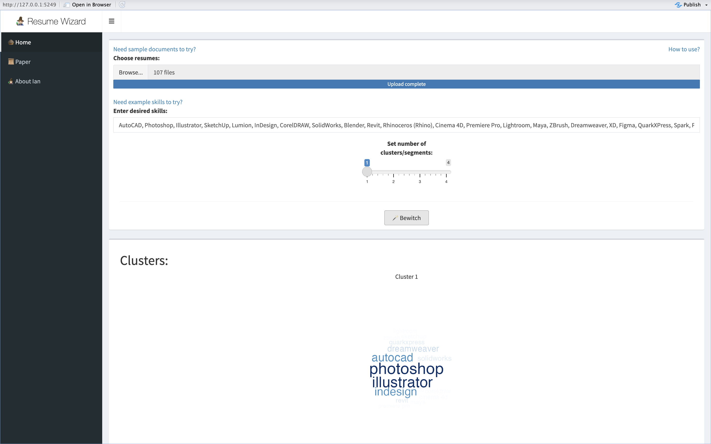
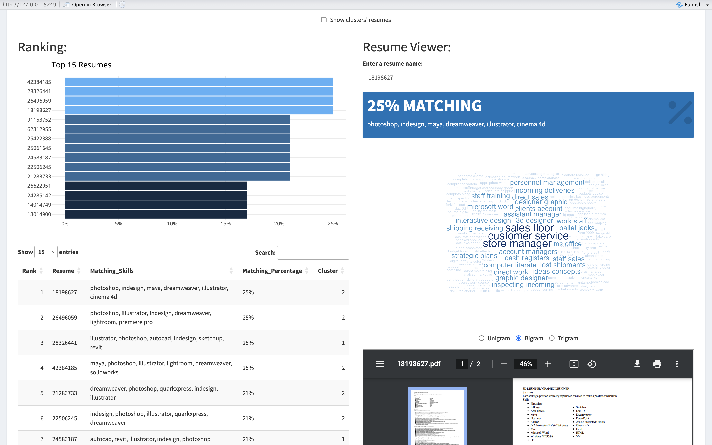
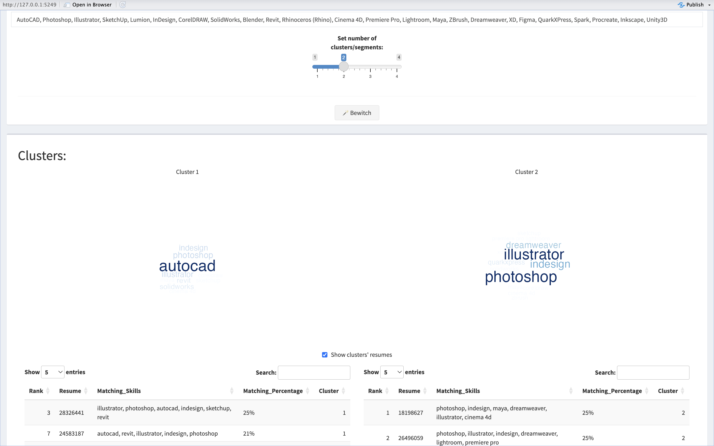

<h5 style="text-align: center;">Ardian the Great</h5>
<h5 style="text-align: center;">January 10th, 2024</h5>
<h3 style="text-align: center;">Resume Ranking & Clustering Tool</h3>

<p style="text-align: justified;">This project is an upgrade of my Resume Wizard web-app, the paper for which can be found <a href="https://rpubs.com/ardian/Resume-Wizard" target="_blank">here</a>. The original project was in September 2023, and was my first-ever Shiny web app (not just a dashboard), and I was in a hurry to submit it to an event at my graduated data science school. Consequently, the web app's code and logic is a bit messy and ineffective, so I intend to upgrade it after the event to make it more polished and efficient. There were also some tokenization challenges in the web app that I couldn't address at the time since i was in a hurry and didn't have the time to learn about it. But now, I have studied about them and now I know what to do for those challenges, and i will do it here in this upgrade.</p>
---

# Introduction
## **Background**
```{r echo=FALSE}
knitr::include_graphics("paper images/background.png")
```

In July 2023, I was scrolling on LinkedIn to learn more about data science applications to know what the industry currently needs in a data scientist. I stumbled upon a data scientist job application that had over 250 applicants. I was shocked to see this and thought, "This is just from one application; what about all the other applications? How much time and energy has the HR team gone through just to find a few most suitable applicants that are probably even not the most suitable?" At that moment, I said to myself, "I need to create something that will boost the resume screening process to be most effective and objective, so that the HR team can save their time and energy for other crucial hiring processes like tests and interviews." And that's how **Resume Wizard** came to be.

## **Project Idea**
Resume Wizard is an innovative web application designed to tackle the challenges of identifying abundant resumes. Inspired by a personal realization where I stumbled upon a job applications with hundreds of applicants, this project aims to bring resume screening smarter, faster, and objective.

With Resume Wizard, companies can find the most suitable resume for the desired skills. It’s a bridge between robots and real people, making hiring better for everyone. I believe this will help companies succeed in today’s competitive job market.

```{r echo=FALSE}
knitr::include_graphics("paper images/project-idea.jpg")
```

I want to make hiring smarter, faster, and objective. With my project, companies can find the best applicants, even if their resumes are a bit different. It’s a bridge between robots and real people, making hiring better for everyone. I believe this will help companies succeed in today’s competitive job market.

## **Study Literature**
### N-Gram
N-grams are contiguous sequences of n items from a given sample of text or speech. In the context of text analysis, these items are often words. Unigrams (1-grams) represent single words, bigrams (2-grams) are pairs of consecutive words, and trigrams (3-grams) consist of three-words sequences, and so on. N-grams capture local patterns and relationships between words, allowing for a more comprehensive analysis of language structure.
 
```{r echo=FALSE, fig.align='center', out.width='75%'}
knitr::include_graphics("paper images/n-gram.png")
```

## **Project Output**
The output of this project is a Shiny Apps based Web App that can be used by anyone for ranking and clustering resumes. And the goal is to find th most suitable resumes based on the desired skills.

## **Impact**
### Improved Efficiency in Resume Screening
Resume Wizard significantly enhances the efficiency of the resume screening process for HR professionals. By automating the ranking and clustering of resumes based on desired skills, the app streamlines the initial screening phase. This leads to a more efficient use of HR resources, allowing them to focus on other critical aspects of the hiring process.

### Time and Energy Savings
The automation of text processing, ranking, and clustering reduces the manual effort required to sift through numerous resumes. HR professionals can save valuable time that would otherwise be spent on manual resume evaluation. This time-saving feature enables HR teams to handle larger volumes of resumes effectively, allowing the recruiters to leverage more time and energy on other critical aspects of the hiring process, such as interviews and such.

### Objective Decision-Making
The ranking algorithm, based on matching skills and percentages, provides a more objective and standardized approach to evaluating resumes. This reduces the subjectivity often associated with manual resume screening, ensuring a fair and consistent evaluation process.

### Data Driven Candidate Matching
By clustering resumes based on desired skills, the app enables HR professionals to identify patterns and similarities among resumes. This can lead to more accurate and targeted candidate matching, ensuring that candidates with the most relevant skills are considered for specific roles.

# Back-end Functions
## **Used Libraries**
```{r message=FALSE}
library(tidyverse)
library(ggplot2)
library(plotly)
library(scales)
library(purrr)
library(tm)
library(NLP)
library(proxy)
library(NLP)
library(pdftools)
library(data.table)
library(tools)
library(tidytext)
library(glue)
library(textclean)
library(tokenizers)
library(stringr)
library(wordcloud)
library(RColorBrewer)
```

## **Folder to Table Converter Function**
The `folder_to_table()` function serves the purpose of transforming a folder of PDF documents into a structured table, represented as a data frame.

### Function Input:
- ***folder_path***: The path to the PDFs folder

### Function Workflow:
1. Extract the raw text
2. Extract the file name
3. Create the data frame

### Function Output:
The output is a data frame with the row names representing the file name and column text representing the raw extracted text.

### Function Code:
```{r}
PDFs_folder_to_table <- function(folder_path) {
  # Function to convert PDF to text
  convert_pdf_to_text <- function(pdf_path) {
    pdf_text_content <- pdf_text(pdf_path)
    
    extracted_text <- list()
    
    for (page in seq_along(pdf_text_content)) {
      text <- pdf_text_content[[page]]
      extracted_text[[page]] <- text
    }
    
    all_text <- paste(extracted_text, collapse = "\n")
  }
  
  # Function to get file name
  get_file_name <- function(file_path) {
    file_path_sans_ext(basename(file_path))
  }
  
  # Getting PDF files from the specified folder
  pdf_files <- list.files(folder_path, pattern = ".pdf", full.names = TRUE)
  
  # Converting PDFs to text
  pdf_texts <- lapply(pdf_files, convert_pdf_to_text)
  
  # Creating a data frame for the extracted texts
  table_data <- data.frame(
    PDF_Text = unlist(pdf_texts)
  )
  
  # Renaming the data frame rows with the file names
  rownames(table_data) <- get_file_name(pdf_files)
  
  return(table_data)
}
```

### Function Test:
I will use a collection of designer profession resumes that I got from <a href="https://www.kaggle.com/datasets/snehaanbhawal/resume-dataset" target="_blank">here</a>.
```{r}
resumes_df <- PDFs_folder_to_table("dataset")

resumes_df %>% head()
```

#### Resume PDF vs Extracted Text Comparison: {.tabset}

##### 10466583.pdf
```{r echo=FALSE}
knitr::include_graphics("paper images/10466583.png")
```

##### 10466583's extracted PDF text
```{r}
resumes_df["10466583", "PDF_Text"]
```

> I know it's a little messy, but don't worry, I'll clean the texts with the next function.

## **Text Cleaner Function**
The `clean_text()` function is designed to clean text data.

### Function Input:
- ***text***: Raw text input.
- ***as_corpus***: If TRUE, the function will return the text in the form of a corpus.
- *Other conditional statements*: These are conditional statements specifying transformations to be applied to the text.

### Function Workflow:
1. Transform the input text into a text corpus
2. Convert all text to lowercase,i
3. Remove stop-words
4. Remove punctuation marks
5. Apply text stemming to reduce words to their base forms
6. Eliminate extra spaces
7. Return the cleaned text corpus

### Function Output:
The output is the cleaned text in the form of a character or corpus based on the ***as_corpus*** argument.

### Function Code:
```{r}
clean_text <- function(text, as.corpus = T, lower = T, rm.number = T, rm.stopwords_english = T, rm.stopwords_bahasa = T, rm.punctuation = T, stem = T, rm.whitespace = T){
  text_corpus <- text %>% VectorSource() %>% VCorpus()
  
  # Lowercasing
  if (lower){
    text_corpus <- tm_map(x = text_corpus,
                          FUN = content_transformer(tolower))
  }
  # Removing numbers
  if (rm.number){
    text_corpus <- tm_map(x = text_corpus,
                          FUN = removeNumbers)
  }
  # Removing english stop words
  if (rm.stopwords_english){
    list_stop_words_english <- readLines("stop-words_english.txt", warn = FALSE, encoding = "UTF-8")
    
    text_corpus <- tm_map(x = text_corpus,
                          FUN = removeWords,
                          list_stop_words_english)
  }
  # Removing bahasa stop words
  if (rm.stopwords_bahasa){
    list_stop_words_bahasa <- readLines("stop-words_bahasa.txt", warn = FALSE, encoding = "UTF-8")
    
    text_corpus <- tm_map(x = text_corpus,
                          FUN = removeWords,
                          list_stop_words_bahasa)
  }
  # Removing punctuation
  if (rm.punctuation){
    text_corpus <- tm_map(x = text_corpus,
                          FUN = removePunctuation)
  }
  # Reducing words to their base form
  if (stem){
    text_corpus <- tm_map(x = text_corpus,
                          FUN = stemDocument)
  }
  # Removing white/blank spaces
  if (rm.whitespace){
    text_corpus <- tm_map(x = text_corpus,
                          FUN = stripWhitespace)
  }
  
  # Returning the text as or not as corpus
  if (as.corpus){
    return(text_corpus)
  }
  else(
    return(sapply(text_corpus, as.character))
  )
}
```

> You may think "Why you gotta put if else statements for each transformation?" It's because this function is taken directly from my personal package and there's no need to remove them. I can just use the parameters to adjust"

### Function Test:
```{r}
resumes_df$PDF_Text <- clean_text(resumes_df$PDF_Text, as.corpus = F, rm.number = F, rm.stopwords_english = F, rm.stopwords_bahasa = F, stem = F)

resumes_df %>% head()
```

## **Word Cloud Function**
The `get_wordcloud()` function is created to generate a word cloud that emphasizes words for specific analysis.

### Function Input:
- ***tokens***: a tokenized text.
- ***scale***: The size scale of tokens in th word cloud
- ***normalize_higher_ngrams***: A conditional statement to normalize higher ngrams or not

### Function Workflow:
1. Tokenize the words
2. Create a data frame containing the frequency of each word
3. Generate a word cloud plot

### Function Output:
The output is a word cloud plot representing the input text/words.

### Function Code:
```{r}
get_wordcloud <- function(tokens, scale = c(2, 0), normalize_higher_ngrams = F) {
  
  # Creating a data frame of tokens and count their occurrences.
  words <- data.frame(token = tokens) %>%
    count(token, sort = TRUE) %>% 
    na.omit()
  
  # Calculate the tf-idf weight of each token
  if (normalize_higher_ngrams){
    words <- words %>% rowwise() %>% mutate(n = n * length(unlist(str_split(token, " "))) + 1)
  }
  
  # Generating a word cloud with specified settings, scaling word size by frequency
  words %>%
    with(
      wordcloud(
        words = token,
        random.order = FALSE,
        color = colorRampPalette(c("#B8E2FF", "#00416F"))(length(unique(words$token))),
        min.freq = 1,
        scale = scale,
        rot.per = 0,
        freq = n
      )
    )
}
```

### Function Test:
```{r warning=FALSE}
get_wordcloud(resumes_df[1, 1] %>% clean_text(as.corpus = F, rm.stopwords_english = T) %>% tokenize_words() %>% unlist(), c(3, 1))
```

## **Resume Ranking Function**
The `rank_resumes()` function is designed to rank resumes based on their similarity to the desired skills.

### Function Input:
- ***resume_df***: a data frame resulted from the function `PDFs_folder_to_table()`.
- ***desired_skills***: This is the set of skills or keywords that are desired to be found in the resumes.
- ***descriptive_skills***: A conditional statement that states if the desired skills are descriptive or not

### Function Workflow:
1. Tokenize the desired skills
3. Extract matching skills within each resume
4. Calculate the macthing percentage
5. Sort Resumes by the matching percentage

### Function Output:
The output is a data frame that includes 4 columns: *PDF_Text*; *Matching_Skills*; *Matching_Percentage*; and *Matching_Percentage_Formatted*

### Function Code:
```{r}
rank_resumes <- function(resumes_df, desired_skills, descriptive_skills = F) {
  # Function to tokenize the text by n gram range
  tokenize_ngrams_by_range <- function(text, upper_range) {
    tokens <- c()
    for (i in upper_range:1) {
      tokens <- c(tokens, unlist(tokenize_ngrams(text, n = i)))
    }
    
    return(tokens)
  }
  
  # Tokenizing the desired skills
  if (descriptive_skills){
    desired_skills <- desired_skills %>% clean_text(as.corpus = F,
                                                    lower = T,
                                                    rm.number = F,
                                                    rm.stopwords_english = T,
                                                    rm.stopwords_bahasa = T,
                                                    rm.punctuation = T,
                                                    stem = T,
                                                    rm.whitespace = T)
    tokenized_desired_skills <- desired_skills %>% tokenize_ngrams_by_range(2)
    resumes_df$PDF_Text <- resumes_df$PDF_Text %>% clean_text(as.corpus = F,
                                                              lower = T,
                                                              rm.number = F,
                                                              rm.stopwords_english = T,
                                                              rm.stopwords_bahasa = T,
                                                              rm.punctuation = T,
                                                              stem = T,
                                                              rm.whitespace = T)
    max_n_gram <- 2
  } else{
  tokenized_desired_skills <- unlist(str_split(desired_skills %>% tolower() %>% trimws(), ", ")) %>% unique()
  max_n_gram <- strsplit(desired_skills, ", ") %>% sapply(length) %>% max()
  }
  
  # Creating the ranking data frame
  ranking_df <- resumes_df %>% 
    rowwise() %>% 
    # Extracting the matching skills
    mutate(Matching_Skills = intersect(tokenize_ngrams_by_range(PDF_Text, max_n_gram), tokenized_desired_skills) %>% paste(collapse = ", "),
           # Calculating the matching percentage
           Matching_Percentage = ifelse(Matching_Skills == "", 0, round(length(unlist(str_split(Matching_Skills, ", "))) / length(tokenized_desired_skills), 2)),
           Matching_Percentage_Formatted = paste0(Matching_Percentage * 100, "%")) %>% 
    as.data.frame() %>% 
    mutate(Resume = rownames(resumes_df)) %>% 
    arrange(desc(Matching_Percentage)) %>% 
    select(Resume, everything())
  
  return(ranking_df)
}
```

### Function Test:{.tabset}

#### Descriptive skills
```{r}
desired_skills <- "- **Expertise in Image Manipulation:** Skilled in working with light, transparencies, color density, shadowing, and understanding image resolution and sizing.
- **Retouching and Selection:** Strategic approach to retouching, manipulating selections, and using advanced selection tools like Magnetic Lasso.
- **Layer Management:** Creating and managing layers, applying gradients, layer styles, borders, and adjustment layers for enhancing images.
- **Proficient in Adobe Photoshop:** Extensive experience in utilizing Photoshop tools such as masking, layers, silos, and camera raw adjustments.
- **Specialized Techniques:** Proficient in advanced techniques like creating panoramas, correcting image distortion, and extending depth of field.
- **Content Manipulation:** Expertise in content-aware tools for moving and manipulating objects seamlessly within images.
- **Prototyping:** Building interactive prototypes to demonstrate the functionality and flow of designs.
- **Wireframing:** Creating basic layouts outlining the structure of a website or application.
- **Vector Graphics:** Proficiency in using vector-based software like Adobe Illustrator for scalable and high-quality graphics.
- **Photo Editing:** Skills in enhancing and retouching photos for various design projects.
- **Creative Problem-Solving:** Ability to find innovative solutions to design challenges and think critically about design problems.
- **Storyboarding:** Planning and visualizing the sequence of events for multimedia presentations or animations.
- **Digital Illustration:** Creating original digital artwork and illustrations using tools like Adobe Photoshop or Adobe Illustrator.
- **Print Design:** Experience in designing for print media, including brochures, posters, business cards, and other promotional materials.
- **Collaboration:** Ability to work effectively in a team, collaborate with clients, and communicate design ideas clearly.
- **Time Management:** Skill in managing multiple projects, meeting deadlines, and prioritizing tasks efficiently."

ranking <- rank_resumes(resumes_df, desired_skills, T)

ranking
```

#### Non descriptive skills
```{r}
desired_skills <- "AutoCAD, Photoshop, Illustrator, SketchUp, Lumion, InDesign, CorelDRAW, SolidWorks, Blender, Revit, Rhinoceros (Rhino), Cinema 4D, Premiere Pro, Lightroom, Maya, ZBrush, Dreamweaver, XD, Figma, QuarkXPress, Spark, Procreate, Inkscape, Unity3D"

ranking <- rank_resumes(resumes_df, desired_skills, F)

ranking
```

## **Resume Clustering Function**
The `cluster_resumes()` function is made to cluster the ranked resumes based on the matching skills.

### Function Input:
- ***ranking_df***: The resumes ranking resulted from the `rank_resume()` function.
- ***k***: The desired number of clusters/segments.

### Function Workflow:
1. Create document term matrix for the matching skills
2. Apply K-means clustering with the desired number centers/clusters/segments

### Function Output:
The output is the resumes with a new column: *Cluster*.

### Function Code:
```{r}
cluster_resumes <- function(ranking_df, k){
  
  # Creating document term matrix of ranking_df
  dtm <- DocumentTermMatrix((ranking_df %>% mutate(Matching_Skills = removePunctuation(Matching_Skills)))$Matching_Skills)
  
  # Converting the document term matrix into a data frame
  df <- dtm %>%
    as.matrix() %>% 
    as.data.frame()
  
  # Replacing the row names with the resume file names
  rownames(df) <- rownames(ranking_df)
  
  # Applying K-means Clustering algorithm 
  clusters <- kmeans(x = df,
                     centers = k)
  
  clustered_ranking_df <- ranking_df %>% mutate(Cluster = clusters$cluster)
  
  return(clustered_ranking_df)
}
```

### Function Test:
```{r}
clustered_ranking_df <- cluster_resumes(ranking, 2)

clustered_ranking_df
```

# Visualizations
## **Top 15 Resumes Bar Chart**
```{r}
ggplot <- ranking %>% 
  slice(1:15) %>% 
  ggplot(aes(y = reorder(Resume, Matching_Percentage),
             x = Matching_Percentage,
             fill = Matching_Percentage,
             text = glue("{Resume}
                         {Matching_Percentage_Formatted} Matched"))) +
  geom_col(show.legend = F) +
  labs(title = "Top 15 Resumes",
       y = NULL,
       x = NULL) +
  scale_x_continuous(labels = percent_format(scale = 100)) +
  scale_fill_gradient(brewer.pal(9, "Blues")) +
  theme_minimal()

ggplotly(ggplot, tooltip = "text")
```

## **Clusters' Matching Skills Word Cloud** {.tabset}

### Cluster 1
```{r warning=FALSE}
tokens_cluster_1 <- clustered_ranking_df[clustered_ranking_df$Matching_Skills != "" & clustered_ranking_df$Cluster == 1, "Matching_Skills"] %>% 
  paste(collapse = ", ") %>% 
  str_split(", ") %>% 
  unlist()

get_wordcloud(tokens_cluster_1, c(3, 1), F)
```

### Cluster 2
```{r warning=FALSE}
tokens_cluster_2 <- clustered_ranking_df[clustered_ranking_df$Matching_Skills != "" & clustered_ranking_df$Cluster == 2, "Matching_Skills"] %>% 
  paste(collapse = ", ") %>% 
  str_split(", ") %>% 
  unlist()

get_wordcloud(tokens_cluster_2, c(3, 1), F)
```

## **Resume Text Words Distribution**
```{r warning=FALSE}
resume_name <- "26496059"

resume_data <- clustered_ranking_df %>% 
  filter(Resume == resume_name)

resume_words_cleaned <- clean_text(resume_data$PDF_Text, as.corpus = F, rm.number = F, rm.stopwords_english = T, rm.stopwords_bahasa = T, rm.punctuation = F, stem = F, rm.whitespace = T)

get_wordcloud(resume_words_cleaned %>% str_split(" ") %>% unlist(), scale = c(2, 0))
```

> 😎

# Shiny Web-app
<p style="text-align: center;"><a href="https://ardian.shinyapps.io/Resume-Wizard_2/" target="_blank">Here</a> is the link to the web-app.</p>

## **Overview** {.tabset}

### input
```{r echo=FALSE}

```

### Ranking & Resume Viewer
```{r echo=FALSE}

```

### Clustering
```{r echo=FALSE}

```

## **Web-app Work Flow**
### Input:
The inputs will be resume PDFs, ideal skills, a conditional statement that states if the input skills are desriptive or not, and a number of clusters/segments.

### Data Preprocessing:
The app converts the PDF files into raw text. Finally, the app creates a data frame containing the raw text of the pdf and the file names as row names.

### Text Preprocessing:
The text processing involves converting all text into lowercase, removing punctuation marks, and stripping white spaces. And if the desired skills are descriptive, the text processing continues by removing numbers, removing stop words, and stemming words into their most base form.

### Ranking:
The desired skills are then lowered and tokenized, and the cleaned text is tokenized into a specific range of n grams. The app then calculate the matching percentage by dividing the total matching skills against the total desired skills. The resumes data frame are then sorted by the matching percentage in descending order.

### Resume Viewer:
The app then displays a text input where the user can input a resume name. When a resume name is input, the app displays a value box containing the matching percentage, following with matching skills. Below the value box, there will be a word cloud of the resume words distribution. Below the word cloud, there are a radio buttons input which are n grams choices: Unigram; Bigram; and Trigram, on default, it is set to Unigram. When an n grams is chosen, the word cloud plot will change based on the n grams choice. Below the radio buttons input, there will be the pdf viewer of the input resume itself.

### Clustering:
After the ranking, Matching skills are then used as features for clustering, the resumes are then clustered by the desired numbers of clusters/segments. Then, the app displays the word clouds of matching skills from each cluster, following with the resumes table of each cluster.

## **Limiations & Notes**
1. The documents input must be in PDF format.
2. Only texts will be extracted, which means images will be ignored.
