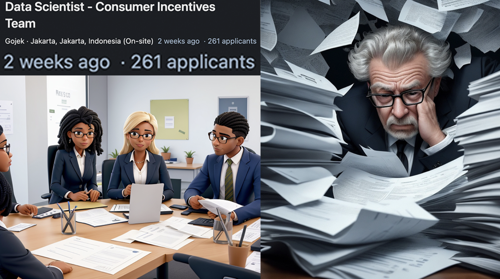
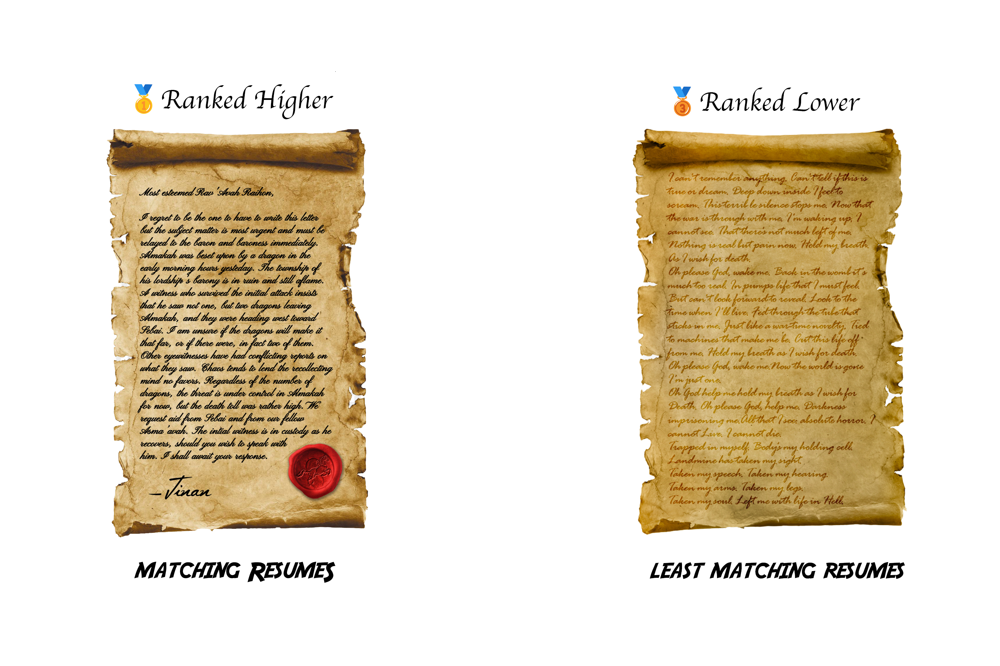
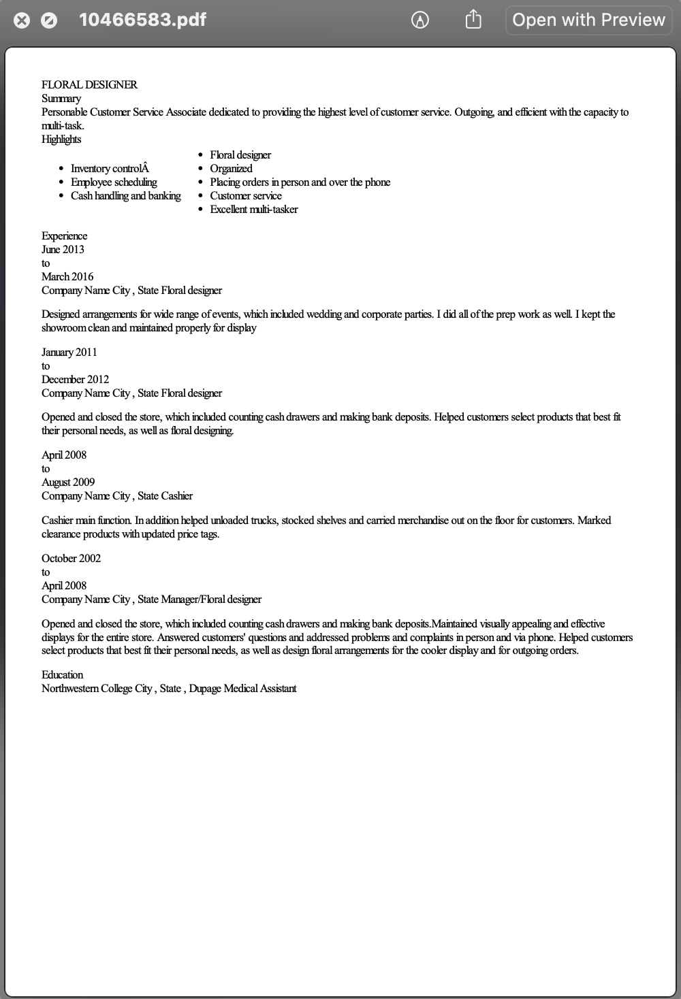

<h5 style="text-align: center;">Ardian the Great</h5>
<h5 style="text-align: center;">October 4th, 2023</h5>
<h3 style="text-align: center;">Resume Ranking & Clustering</h3>

<p style="text-align: justified;">This project is an upgrade of my Resume Wizard app, the paper for which can be found here: https://rpubs.com/ardian/Resume-Wizard. The original project was my first-ever end-to-end Shiny web app, and I was in a hurry to submit it to an event at my graduated data science school. Consequently, the web app's code and logic is a bit messy and ineffective, so I intend to upgrade it after the event to make it more polished and efficient. There were also some tokenization challenges in the web app that I couldn't address at the time since i was in a hurry and didn't have the time to learn about it. But now, I have studied about them and now I know what to do for those challenges, and i will do it here in this upgrade.</p>
---

# Introduction
## **Background**
```{r echo=FALSE}

```

In July 2023, I was scrolling on LinkedIn to learn more about data science applications to know what the industry currently needs in a data scientist. I stumbled upon a data scientist job application that had over 250 applicants. I was shocked to see this and thought, "This is just from one application; what about all the other applications? How much time and energy has the HR team gone through just to find a few most suitable applicants that are probably even not the most suitable?" At that moment, I said to myself, "I need to create something that will boost the resume screening process to be most effective and objective, so that the HR team can save their time and energy for other crucial hiring processes like tests and interviews." And that's how **Resume Wizard** came to be.

## **Project Idea**
Resume Wizard is an innovative web application designed to tackle the challenges of identifying abundant resumes. Inspired by a personal realization where I stumbled upon a job applications with hundreds of applicants, this project aims to bring resume screening smarter, faster, and objective.

With Resume Wizard, companies can find the most suitable resume for the desired criteria. It’s a bridge between robots and real people, making hiring better for everyone. I believe this will help companies succeed in today’s competitive job market.

```{r echo=FALSE}

```

I want to make hiring smarter, faster, and objective. With my project, companies can find the best applicants, even if their resumes are a bit different. It’s a bridge between robots and real people, making hiring better for everyone. I believe this will help companies succeed in today’s competitive job market.

## **Study Literature**
### N-Gram
N-grams are contiguous sequences of n items from a given sample of text or speech. In the context of text analysis, these items are often words. Unigrams (1-grams) represent single words, bigrams (2-grams) are pairs of consecutive words, and trigrams (3-grams) consist of three-words sequences, and so on. N-grams capture local patterns and relationships between words, allowing for a more comprehensive analysis of language structure.
 
```{r echo=FALSE, fig.align='center', out.width='75%'}
knitr::include_graphics("paper images/n-gram.png")
```

## **Project Output**
The output of this project is a Shiny Apps based Web App that can be used by anyone for ranking and clustering resumes. And the goal is to find th most suitable resumes based on the desired criterias.

## **Impact**

## **Work Flow**
### Input:
The inputs will be resume PDFs and number of clusters/segments

### Data Preprocessing:
The app converts the PDF files into raw text. Finally, the app creates a data frame containing the raw text of the pdf and the file names as row names.

### Text Preprocessing:
The text processing involves converting all text into lowercase, removing punctuation marks, and stripping white spaces.

### Ranking:
The desired criteria is then lowered and tokenized, and the cleaned text is tokenized into a specific range of n grams. The app then calculate the matching percentage by dividing the total matching criteria against the total desired criteria. The resumes data frame are then sorted by the matching percentage in descending order.

### Clustering:
After the ranking, Matching Criteria are then used as features for clustering, the resumes are then clustered by the desired numbers of clusters/segments.

# Back-end Functions
## **Used Libraries**
```{r message=FALSE}
library(dplyr)
library(ggplot2)
library(plotly)
library(scales)
library(purrr)
library(tm)
library(NLP)
library(proxy)
library(NLP)
library(pdftools)
library(data.table)
library(tools)
library(tidyverse)
library(tidytext)
library(glue)
library(textclean)
library(tokenizers)
library(stringr)
library(wordcloud)
library(RColorBrewer)
```

## **Folder to Table Converter Function**
The `folder_to_table()` function serves the purpose of transforming a folder of PDF documents into a structured table, represented as a data frame.

### Function Input:
- ***folder_path***: The path to the PDFs folder

### Function Workflow:
1. Extract the raw text
2. Extract the file name
3. Create the data frame

### Function Output:
The output is a data frame with the row names representing the file name and column text representing the raw extracted text.

### Function Code:
```{r}
PDFs_folder_to_table <- function(folder_path) {
  # Function to convert PDF to text
  convert_pdf_to_text <- function(pdf_path) {
    pdf_text_content <- pdf_text(pdf_path)
    
    extracted_text <- list()
    
    for (page in seq_along(pdf_text_content)) {
      text <- pdf_text_content[[page]]
      extracted_text[[page]] <- text
    }
    
    all_text <- paste(extracted_text, collapse = "\n")
  }
  
  # Function to get file name
  get_file_name <- function(file_path) {
    file_path_sans_ext(basename(file_path))
  }
  
  # Getting PDF files from the specified folder
  pdf_files <- list.files(folder_path, pattern = ".pdf", full.names = TRUE)
  
  # Converting PDFs to text
  pdf_texts <- lapply(pdf_files, convert_pdf_to_text)
  
  # Creating a data frame for the extracted texts
  table_data <- data.frame(
    PDF_Text = unlist(pdf_texts)
  )
  
  # Renaming the data frame rows with the file names
  rownames(table_data) <- get_file_name(pdf_files)
  
  return(table_data)
}
```

### Function Test:
I will use a collection of designer profession resumes that I got from <a href="https://www.kaggle.com/datasets/snehaanbhawal/resume-dataset">here</a>.
```{r}
pdf_df <- PDFs_folder_to_table("dataset")

pdf_df %>% head()
```

#### Resume PDF vs Extracted Text Comparison: {.tabset}

##### 10466583.pdf
```{r echo=FALSE}

```

##### 10466583's extracted PDF text
```{r}
pdf_df["10466583", "PDF_Text"]
```

> I know it's a little messy, but don't worry, I'll clean the texts with the next function.

## **Text Cleaner Function**
The `clean_text()` function is designed to clean text data.

### Function Input:
- ***text***: Raw text input.
- ***as_corpus***: If TRUE, the function will return the text in the form of a corpus.
- *Other conditional statements*: These are conditional statements specifying transformations to be applied to the text.

### Function Workflow:
1. Transform the input text into a text corpus
2. Convert all text to lowercase
3. Remove stop-words
4. Remove punctuation marks
5. Apply text stemming to reduce words to their base forms
6. Eliminate extra spaces
7. Return the cleaned text corpus

### Function Output:
The output is the cleaned text in the form of a character or corpus based on the ***as_corpus*** argument.

### Function Code:
```{r}
clean_text <- function(text, as.corpus = T, lower = T, rm.number = T, rm.stopwords_english = T, rm.stopwords_bahasa = T, rm.punctuation = T, stem = T, rm.whitespace = T){
  text_corpus <- text %>% VectorSource() %>% VCorpus()
  
  # Lowercasing
  if (lower){
    text_corpus <- tm_map(x = text_corpus,
                          FUN = content_transformer(tolower))
  }
  # Removing numbers
  if (rm.number){
    text_corpus <- tm_map(x = text_corpus,
                          FUN = removeNumbers)
  }
  # Removing english stop words
  if (rm.stopwords_english){
    list_stop_words_english <- readLines("stop-words_english.txt", warn = FALSE, encoding = "UTF-8")
    
    text_corpus <- tm_map(x = text_corpus,
                          FUN = removeWords,
                          list_stop_words_english)
  }
  # Removing bahasa stop words
  if (rm.stopwords_bahasa){
    list_stop_words_bahasa <- readLines("stop-words_bahasa.txt", warn = FALSE, encoding = "UTF-8")
    
    text_corpus <- tm_map(x = text_corpus,
                          FUN = removeWords,
                          list_stop_words_bahasa)
  }
  # Removing punctuation
  if (rm.punctuation){
    text_corpus <- tm_map(x = text_corpus,
                          FUN = removePunctuation)
  }
  # Reducing words to their base form
  if (stem){
    text_corpus <- tm_map(x = text_corpus,
                          FUN = stemDocument)
  }
  # Removing white/blank spaces
  if (rm.whitespace){
    text_corpus <- tm_map(x = text_corpus,
                          FUN = stripWhitespace)
  }
  
  # Returning the text as or not as corpus
  if (as.corpus){
    return(text_corpus)
  }
  else(
    return(sapply(text_corpus, as.character))
  )
}
```

> You may think "Why you gotta put if else statements for each transformation?" It's because this function is taken directly from my personal package and there's no need to remove them. I can just use the parameters to adjust"

### Function Test:
```{r}
pdf_df$PDF_Text <- clean_text(pdf_df$PDF_Text, as.corpus = F, rm.number = F, rm.stopwords_english = F, rm.stopwords_bahasa = F, stem = F)

pdf_df %>% head()
```

## **Word Cloud Function**
The `get_wordcloud()` function is created to generate a word cloud that emphasizes words for specific analysis.

### Function Input:
- ***words***: a tokenized text.
- ***palette***: The color palette for the word clouds.

### Function Workflow:
1. Tokenize the words
2. Create a data frame containing the frequency of each word
3. Generate a word cloud plot

### Function Output:
The output is a word cloud plot representing the input text/words.

### Function Code:
```{r}
get_wordcloud <- function(tokens, palette, scale = c(2, 0)){
  
  # Creating a data frame of matching words and count their occurrences.
  words <- data.frame(token = tokens) %>%
    count(token, sort = TRUE)
  
  # Generating a word cloud with specified settings, scaling word size by frequency
  words %>%
    with(
      wordcloud(
        words = token,
        random.order = FALSE,
        color = brewer.pal(9, palette),
        min.freq = 1,
        scale = scale,
        rot.per = 0,
        freq = n
      )
    )
}
```

### Function Test:
```{r warning=FALSE}
get_wordcloud(pdf_df[1, 1] %>% tokenize_ngrams(n = 2) %>% unlist(), "Greens")
```

## **Resume Ranking Function**
The `rank_resumes()` function is designed to rank resumes based on their similarity to the desired criteria.

### Function Input:
- ***ideal_criteria***: This is the set of criteria or keywords that are desired to be found in a resume.
- ***resume_df***: a data frame resulted from the function `PDFs_folder_to_table()`.

### Function Workflow:
1. Tokenize the ideal criteria
3. Extract matching criteria within each resume
4. Calculate the macthing percentage
5. Sort Resumes by the matching percentage

### Function Output:
The output is a data frame that includes 4 columns: *PDF_Text*; *Matching_Criteria*; *Matching_Percentage*; and *Matching_Percentage_Formatted*

### Function Code:
```{r}
rank_resumes <- function(ideal_criteria, resumes_df) {
  # Tokenizing the ideal criteria
  tokenized_ideal_criteria <- unlist(str_split(ideal_criteria %>% tolower() %>% trimws(), ", ")) %>% unique()
  
  max_n_gram <- strsplit(ideal_criteria, ", ") %>% sapply(length) %>% max()
  
  # Function to tokenize the text by n gram range
  tokenize_ngrams_by_range <- function(text, upper_range) {
    tokens <- c()
    for (i in 1:upper_range) {
      tokens <- c(tokens, unlist(tokenize_ngrams(text, n = i)))
    }
    
    return(tokens)
  }
  
  # Creating the ranking data frame
  ranking_df <- resumes_df %>% 
    rowwise() %>% 
    # Extracting the matching criteria
    mutate(Matching_Criteria = intersect(tokenize_ngrams_by_range(PDF_Text, max_n_gram), tokenized_ideal_criteria) %>% paste(collapse = ", "),
           # Calculating the matching percentage
           Matching_Percentage = ifelse(Matching_Criteria == "", 0, round(length(unlist(str_split(Matching_Criteria, ", "))) / length(tokenized_ideal_criteria), 2)),
           Matching_Percentage_Formatted = paste0(Matching_Percentage * 100, "%")) %>% 
    as.data.frame() %>% 
    mutate(Resume = rownames(resumes_df)) %>% 
    arrange(desc(Matching_Percentage)) %>% 
    select(Resume, everything())
  
  return(ranking_df)
}
```

### Function Test:
```{r}
ideal_criteria <- "AutoCAD, Photoshop, Illustrator, SketchUp, Lumion, InDesign, CorelDRAW, SolidWorks, Blender, Revit, Rhinoceros (Rhino), Cinema 4D, Premiere Pro, Lightroom, Maya, ZBrush, Dreamweaver, XD, Figma, QuarkXPress, Spark, Procreate, Inkscape, Unity3D"

ranking %>% mutate(Rank = row_number())

```

## **Resume Clustering Function**
The `cluster_resumes()` function is made to cluster the ranked resumes based on the matching criteria.

### Function Input:
- ***ranking_df***: The resumes ranking resulted from the `rank_resume()` function.
- ***k***: The desired number of clusters/segments.

### Function Workflow:
1. Create document term matrix for the resumes ranking data frame
2. Apply K-means clustering with the desired number centers/clusters/segments

### Function Output:
The output is the resumes with a new column: *Cluster*.

### Function Code:
```{r}
cluster_resumes <- function(ranking_df, k){
  
  # Creating document term matrix of ranking_df
  dtm <- DocumentTermMatrix((ranking_df %>% mutate(Matching_Criteria = removePunctuation(Matching_Criteria)))$Matching_Criteria)
    
  # Converting the document term matrix into a data frame
  df <- dtm %>%
    as.matrix() %>% 
    as.data.frame()
    
  # Replacing the row names with the resume file names
  rownames(df) <- rownames(ranking_df)
  
  # Applying K-means Clustering algorithm 
  clusters <- kmeans(x = df,
                     centers = k)
  
  clustered_ranking_df <- ranking_df %>% mutate(Cluster = clusters$cluster)
  
  return(clustered_ranking_df)
}
```

### Function Test:
```{r}
clustered_ranking_df <- cluster_resumes(ranking, 2)

clustered_ranking_df
```

# Visualizations
## **Top 15 Resumes Bar Chart**
```{r}
ggplot <- ranking %>% 
  slice(1:15) %>% 
  ggplot(aes(y = reorder(Resume, Matching_Percentage),
             x = Matching_Percentage,
             fill = Matching_Percentage,
             text = glue("{Resume}
                         {Matching_Percentage_Formatted} Matched"))) +
  geom_col(show.legend = F) +
  labs(title = "Top 15 Resumes",
       y = NULL,
       x = NULL) +
  scale_x_continuous(labels = percent_format(scale = 100)) +
  scale_fill_gradient(brewer.pal(9, "Blues")) +
  theme_minimal()

ggplotly(ggplot, tooltip = "text")
```

## **Clusters' Matching Criteria Word Cloud**
```{r warning=FALSE}
tokens <- clustered_ranking_df[clustered_ranking_df$Matching_Criteria != "" & clustered_ranking_df$Cluster == 1, "Matching_Criteria"] %>% 
  paste(collapse = ", ") %>% 
  str_split(", ") %>% 
  unlist()

get_wordcloud(tokens, "Blues", c(3, 2))
```

## **Resume's Text Term Distribution**
```{r warning=FALSE}
resume_name <- "26496059"

resume_data <- clustered_ranking_df %>% 
  filter(Resume == resume_name)

resume_words_cleaned <- clean_text(resume_data$PDF_Text, as.corpus = F, rm.number = F, rm.stopwords_english = T, rm.stopwords_bahasa = T, rm.punctuation = F, stem = F, rm.whitespace = T)

get_wordcloud(resume_words_cleaned %>% str_split(" ") %>% unlist(), "Blues", scale = c(2, 0))
```

> 😎

```{r}
tes <- c(3, 2, 4)
print(tes[order(tes)])
```

```{r}
test <- "hallo ini contoh sala h satu text"

tokenize_ngrams(test, n = 2, n_min = 1) %>% unlist()
```


# Shiny Web-app
<p style="text-align: center;"><a href="https://ardian.shinyapps.io/Homework-Truthweaver/">Here</a> is the link to the web-app.</p>

## **Overview** {.tabset}

### input
```{r echo=FALSE}

```

### Ranking & Resume Viewer
```{r echo=FALSE}

```

### Clustering
```{r echo=FALSE}

```

## **User Experience Flow**

## **Limiation & Notes**
1. The documents input must be in PDF format.
2. Only texts will be extracted, which means images will be ignored.
